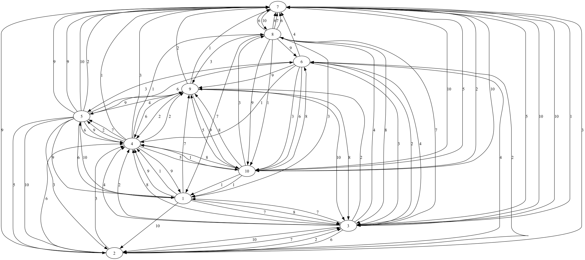

# Audience Republic:: Graph Traversal Coding Assignment
This is my go at the coding assignment for Audience Republic. I spent almost a day learning about Clojure and coding the graph traversal problem in it. This is the first time I am coding in Clojure, so I had to learn about the language's general concepts first and then start coding with the help of GPT and Copilot. I'm liking how concise Clojure can be, even compared to Scala, which is where my functional programming experience comes from. While I got a chance to familiarise myself with the language, I would say it will take a couple of weeks before I feel fully confident coding in it, as the syntax is still a bit confusing to me. I can now read Clojure and make modifications to Clojure code, but when making modifications, I still need the help of GPT/Copilot.

Syntax aside, these are some of the considerations I had in mind when coding this assignment:

* **TDD**: There are test cases for every part, and they can run almost independently of other files.
* I thought adding **graph visualisation** could help verify the code output, so I used Graphviz and dot files.
* I stuck with the suggested way of defining graphs as per this reference. The only issue I see with that is the vector formulation allows **parallel edges**. This could be replaced by a set, which I showcased in `graph_test.clj`.
* For unweighted graphs, it makes more sense to use **BFS** for calculating the shortest paths instead of **Dijkstra**. However, I've added a function in `graph.clj` to convert an unweighted graph into a weighted one (with weights = 1) so that the same shortest paths function can be used for both without modification.
* I was curious how **exception handling** works in Clojure, so exceptions are thrown whenever the number of edges isn't within `(N, N*(N-1))`. More exceptions should be thrown for other cases, such as when floor-weight > cap_weight during random graph generation or calling the convert-to-weighted function on an already weighted graph. I need to learn more about this in production environments.
 

# Directory Structure

```
.
├── src
│   └── graph_traversal
│       ├── core.clj            # Main entry point with a few examples
│       ├── graph.clj           # Graph traversal functions
│       ├── random_graph.clj    # Random graph generation
│       ├── dijkstra.clj        # Dijkstra's shortest path
│       ├── properties.clj      # Graph properties (eccentricity, radius, diameter)
│       └── viz.clj             # Graph visualisation
├── test                        # Unit tests
└── project.clj                 # Leiningen project file

```

# Installation
## Prerequisites

* [Clojure](https://clojure.org/) and [Leiningen](https://leiningen.org/) for running Clojure programs.
* [Graphviz](https://graphviz.org/) for graph visualisation (ensure dot is in your system's `PATH`).

## Project Setup
1. Clone the repository:
   ```
   git clone https://github.com/mvadood/graph-traversal.git
   cd graph-traversal
   ```
2. Install dependencies
   ```
   lein deps
   ```
3. Ensure [Graphviz](https://graphviz.org/) is installed
   ```
   dot -V  # Check Graphviz installation
   ```

# Usage
First of all, start `REPL`
```
lein repl
```

## Graph Traversal (DFS and BFS)
```
(require '[graph-traversal.graph :refer [seq-graph-dfs seq-graph-bfs]])

(def g {:1 [:2 :3], :2 [:4], :3 [:4], :4 []})

;; Perform Depth-First Search
(seq-graph-dfs g :1)  ; => (:1 :3 :4 :2)

;; Perform Breadth-First Search
(seq-graph-bfs g :1)  ; => (:1 :2 :3 :4)

```

## Random Graph Generation
```
(require '[graph-traversal.random-graph :refer [make-graph]])

;; Generate a weakly-connected directed random graph with 10 vertices and 10 edges
(def random-graph (make-graph 10 10))

;; This will throw an exception (not enough edges for the graph to be connected)
(def random-graph (make-graph 10 8))

;; This will throw an exception (Too many edges for the graph for it not to have parallel edges)
(def random-graph (make-graph 10 91))

;; Generate a non-weighted connected random graph with 10 vertices and 10 edges
(def random-graph (make-graph 10 10 :weighted false))

;; You can use graph-traversal.graph/convert-to-weighted to convert a non-weighted graph to a weighted one (with weights = 1)
(def converted (convert-to-weighted random-graph))

;; You can also specify a floor and cap for the weights on each edge
(def random-graph (make-graph 10 10 :weight_floor 12 :weight_cap 100))

```

## Graph visualisation
It is useful to visualise the generated graph to be able to visually cross-check the output of Dijkstra or the properties.

1. **Generate DOT File**:

```
(require '[graph-traversal.viz :refer [save-dot-file]])

;; Save the DOT file for manual visualisation with Graphviz
(save-dot-file random-graph "graph.dot")

```
2. **Render Graph**: Open another terminal and type in the following:

```
dot -Tpng graph.dot -o graph.png
```

Result of `(make-graph 10 90)` / Fully connected 10-node graph


## Shortest Path Calculation (Dijkstra)
```
(require '[graph-traversal.dijkstra :refer [shortest-path]])

;; or pass a random-graph instead
(def g {:1 [[:2 1] [:3 2]], :2 [[:4 4]], :3 [[:4 2]], :4 []})

;; Find the shortest path from node :1 to node :4
(shortest-path g :1 :4)  ; => (:1 :3 :4)
```
## Graph Properties
```
(require '[graph-traversal.properties :refer [eccentricity radius diameter]])

;; or pass a random-graph instead
(def g {:1 [[:2 1] [:3 2]], :2 [[:4 4]], :3 [[:4 2]], :4 []})

;; Calculate eccentricity for node :1
(eccentricity g :1)  ; => 4

;; Calculate the radius of the graph
(radius g)  ; => 2

;; Calculate the diameter of the graph
(diameter g)  ; => 4
```

# Testing
Run the tests using Leiningen:
```
lein test
```